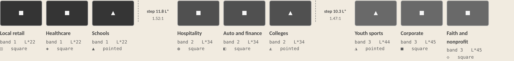
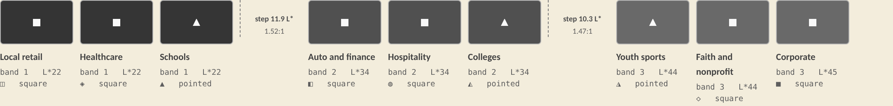
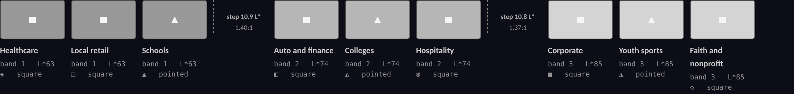

# THEME DIRECTIONS. Research and design, no application code.

Three fully specified directions for re-theming THE OPENING BOOK, with a
recommendation. Nothing here has been applied to the codebase.

## What was asked

> "let's also theme up the play to be fun to match the main event venue. this
> theme is so depression. get multiple UX and apps developers to come and help
> develop a new theme that resembles what main events symbolizes which is a
> arcade play / It's a large family entertainment center"

He is right. The current palette is cool paper, hairlines and one amber, chosen
to read as restrained enterprise software. The product is a prospecting console
for a bowling, arcade, laser tag and Gravity Ropes family entertainment centre,
and it currently looks like a bank.

## What binds, and why it is the interesting part

1. **The owner is colourblind.** Colour is never the only signal anywhere. A
   theme that leans on hue to carry meaning is a downgrade however good it looks.
2. **WCAG contrast.** Every pair below clears 4.5:1 for body text and 3:1 for
   large text and essential graphics, and the computed ratio is published for
   each. Anything that failed was fixed before this document was written.
3. **No Main Event logo, wordmark or trade dress, and no sampled brand
   colours.** Every colour below was constructed in CIELAB at a chosen lightness
   and hue. None was picked off mainevent.com. The source material is the wider
   visual language of family entertainment centres, which nobody owns: lane
   maple and pin white, prize-counter and ticket stock, skee-ball lacquer,
   blacklight and the phosphor palette of an arcade cabinet.
4. **It stays a working tool.** 102 rows of dense data read all day. The fun
   lives in the chrome, the marks, the empty states and the moments of feedback.
   It does not live on the data surfaces, where legibility wins.

## How every number here was produced

`colorlab.py` implements WCAG 2.x relative luminance, CIELAB, CIEDE2000 and the
Vienot, Brettel and Mollon (1999) dichromacy simulation. It was validated by
reproducing the ratios already published in `tokens.css` exactly: `--text-1` at
8.98, 8.51, 7.93, 7.23, 7.89 and 7.70 across the six surfaces named there, and
`--text-3` at 5.79, 5.48, 5.11, 4.66, 5.08 and 4.96. Every palette below is then
constructed in LCh at a stated lightness rather than typed as a hex, and
`check.py` audits the whole set. All three directions currently exit clean.

## Two defects in the palette that is on disk today

Both were found while measuring, not while looking.

**One. `--line-2` and `--line-strong` are below the 3:1 that a control boundary
needs.** `--line-strong` is `#a3aebc`, which is **2.25:1 on `--surface-1`** and
**1.99:1 on `--surface-0`**. It is used in 65 declarations. The resting border on
a secondary button is `--line-2` at 1.57:1 on white, and the button's own fill is
`--surface-1` on a `--surface-0` page, which is 1.13:1. So the visual boundary of
that control is carried by nothing that clears WCAG 1.4.11. This is smaller and
more arguable than the `--text-3` finding the last audit raised, because the
label still carries the affordance, but it is the same class of problem and it is
the kind of thing the next audit will find. For reference the canonical minimum
grey on white is `#767676` at 4.54:1. All three directions below put
`--line-strong` at 3.05:1 or better against the darkest paper in the theme.

**Two. The lane palette no longer has the property its comment claims.**
`tokens.css` argues the nine lanes are Okabe-Ito and therefore safe under
dichromacy. The values on disk are not Okabe-Ito; they were darkened for
contrast, and darkening collapsed the lightness spread that was doing the work.
Measured:

| property | palette on disk | what it means |
|---|---|---|
| smallest gap between adjacent lanes in L* | **0.07** (colleges 41.22, faith 41.30) | two lanes are the same grey |
| span of eight of the nine lanes | **L\* 34.65 to 43.45** | eight lanes inside 9 points of lightness |
| worst pair, all three dichromacies | **1.32 dE2000** (hospitality vs faith, tritanopia) | indistinguishable |
| worst pair under deuteranopia specifically | **3.0 dE2000** (corporate vs faith); auto vs corporate is 4.1 | indistinguishable to the owner |

The file's own claim that the ninth lane "is the one lane that stays separable in
pure greyscale" is true, and it is also an admission that the other eight are
not. Today this is survivable only because the glyph and the word are always
present, which is the contract working as designed. But it means the colour is
currently doing no work at all for this reader, and there is no reason to accept
that when it can be fixed.

## The one structural idea shared by all three directions

**Nine lanes cannot be separated by lightness alone. That is arithmetic, not
taste.**

A lane chip paints the lane colour as text on the lane tint at 9.5px and 11.1px,
so the ink must clear 4.5:1 against a near-white background. That caps it at
about **L\* 45**. Below about L\* 20 every hue is black. The usable ramp is
therefore roughly 25 points of lightness, and nine values spread across it gives
a step of 3.1 L\*, which nobody can resolve in a 9px map marker.

So the ramp is built as a **3 by 3 matrix**: three hue families crossed with
three lightness bands about 11 L\* apart.

|  | cool family (calendar-locked) | earth family (discretionary) | plum family (discretionary) |
|---|---|---|---|
| **band 1**, deepest | schools | local retail and food | healthcare |
| **band 2**, middle | colleges | auto and finance | hospitality |
| **band 3**, lightest | youth sports | corporate | faith and nonprofit |

This buys four things at once.

- **Greyscale gives you the band.** Three flat value steps, 10 to 12 L\* apart,
  1.37:1 to 1.54:1 between adjacent bands. Not nine indistinguishable greys.
- **The cap shape gives you the class.** The pointed and square caps already in
  `LaneChip.module.css` survive greyscale and every dichromacy, and every
  within-band pair differs in cap shape or glyph. Verified programmatically.
- **The temperature story survives.** The existing system's best idea is that
  calendar-locked buyers run cool and discretionary buyers run warm. The cool
  family is exactly the three calendar-locked lanes; earth and plum are the six
  discretionary ones. A reader flicking between boards still feels the
  temperature change.
- **Red-green blindness stops being fatal.** Under protanopia and deuteranopia
  the surviving axis is essentially blue against yellow. Six discretionary lanes
  all picked from the warm half of the wheel land on top of each other, which is
  precisely what happened on disk. Splitting them into an earth family and a plum
  family puts one of each band's pair at the yellow pole and one at the blue
  pole. The floor across all 36 lane pairs moves from **1.32 to 8.48 or better**.

One honest note. Within a band the three lanes are the same grey by design, and
the cap and glyph resolve them. That is a deliberate trade, not an oversight: the
alternative is nine lanes separated by 3 L\*, which resolves nothing and also
fails contrast at the light end.

---
## Direction One. The Approach

*Lane maple, pin white, brass rule.*

Bowling is the only attraction in the building that has a **paper
tradition**: the score sheet, the league book, the standings taped to the wall
behind the counter. That is exactly what this product is. It is a book of names
being built before a room opens, kept by one person, read every morning. So the
direction takes the material of the room rather than the noise of it: hard maple
for the page, pin white for the card, a brass hairline where the old system had
a grey one, and one deep house blue reserved for anything you can press. It is
warm without being loud, which matters because the warmth has to survive being
looked at for six hours. It is also the only one of the three that a general
manager and a hiring manager can both open without a beat of explanation, and it
is the only one where the fun is structural rather than applied: the paper
itself stopped being a spreadsheet.

### Full token set

```css
:root {
  --surface-0: #f1ebe0;
  --surface-1: #fffdf9;
  --surface-2: #faf5ec;
  --surface-3: #e3dbcb;
  --surface-inverse: #1b1610;
  --text-0: #1b1610;
  --text-1: #4b4137;
  --text-2: #574d43;
  --text-3: #675c52;
  --text-inverse: #fbf6ee;
  --accent: #015280;
  --accent-600: #044166;
  --accent-700: #00314f;
  --accent-tint: #e6f0fe;
  --accent-line: #a2bee0;
  --brand-gold: #905900;
  --brand-gold-600: #734600;
  --brand-gold-tint: #feecdb;
  --brand-gold-line: #dcad7b;
  --ok: #036d40;
  --ok-tint: #e3f3e8;
  --warn: #7d5800;
  --warn-tint: #f9eee0;
  --risk: #a63836;
  --risk-tint: #feebe9;
  --info: #09658f;
  --info-tint: #e3f1fe;
  --neutral: #675d54;
  --neutral-tint: #faede3;
  --prov-public: #00677e;
  --prov-illustrative: #5f5697;
  --prov-modeled: #7d5800;
  --prov-observed: #036d40;
  --prov-user: #685c52;
  --prov-withheld: #86487f;
  --lane-schools: #003b43;
  --lane-schools-tint: #dff3f7;
  --lane-colleges: #025b4f;
  --lane-colleges-tint: #e0f3ef;
  --lane-fitness: #007855;
  --lane-fitness-tint: #e3f3eb;
  --lane-corporate: #816609;
  --lane-corporate-tint: #f6eee2;
  --lane-auto: #833935;
  --lane-auto-tint: #feebe9;
  --lane-hospitality: #574194;
  --lane-hospitality-tint: #f2edfa;
  --lane-faith: #a24c79;
  --lane-faith-tint: #fcebf2;
  --lane-healthcare: #492264;
  --lane-healthcare-tint: #f5ecf9;
  --lane-local-retail-food: #582605;
  --lane-local-retail-food-tint: #fcece4;
  --fam-corporate: #003b43;
  --fam-corporate-tint: #dff3f7;
  --fam-youth-group: #007855;
  --fam-youth-group-tint: #e3f3eb;
  --fam-self-serve: #816609;
  --fam-self-serve-tint: #f6eee2;
  --fam-buyout: #574194;
  --fam-buyout-tint: #f2edfa;
  --fam-fundraiser: #833935;
  --fam-fundraiser-tint: #feebe9;
  --ledger-revenue: #452a17;
  --ledger-revenue-tint: #fdece2;
  --ledger-activity: #5f6918;
  --ledger-activity-tint: #f0f1dd;
  --line: #e2dacb;
  --line-2: #bfb097;
  --line-strong: #837a72;
  --op-surface: #ece7dd;
  --op-surface-2: #e0dacd;
  --op-line: #c8bfad;
  --op-accent: #2e593b;
  --op-text-0: #1d1b14;
  --op-text-1: #535343;
}
```

### Contrast table: every text token against every surface it lands on

Ratios are WCAG 2.x relative luminance, computed in `colorlab.py` and verified against the ratios already published in `tokens.css` to the hundredth. Floor is 4.5:1.

| token | hex | s1 | s2 | s0 | s3 | acc·t | gold·t | neu·t | ok·t | warn·t | risk·t | info·t | op1 | op2 | worst |
|---|---|---|---|---|---|---|---|---|---|---|---|---|---|---|---|
| `--text-0` | `#1b1610` | 17.68 | 16.54 | 15.14 | 13.06 | 15.62 | 15.60 | 15.65 | 15.62 | 15.69 | 15.63 | 15.64 | 14.58 | 12.90 | 12.90 **PASS** |
| `--text-1` | `#4b4137` | 9.79 | 9.16 | 8.39 | 7.23 | 8.65 | 8.64 | 8.67 | 8.65 | 8.69 | 8.66 | 8.66 | 8.07 | 7.15 | 7.15 **PASS** |
| `--text-2` | `#574d43` | 8.11 | 7.59 | 6.95 | 5.99 | 7.17 | 7.16 | 7.18 | 7.16 | 7.20 | 7.17 | 7.17 | 6.69 | 5.92 | 5.92 **PASS** |
| `--text-3` | `#675c52` | 6.40 | 5.99 | 5.48 | 4.73 | 5.65 | 5.65 | 5.66 | 5.65 | 5.68 | 5.66 | 5.66 | 5.28 | 4.67 | 4.67 **PASS** |

**Inks, provenance badges and rules.** A lane or status ink carries 9.5px chip text on its own tint, so its floor is 4.5:1 there, and 3:1 where it is only a mark.

| token | hex | on own tint | worst on s0-s3 | required | verdict |
|---|---|---|---|---|---|
| `--accent` | `#015280` | 7.25 | 6.06 | 4.5 on tint, 3.0 as mark | pass |
| `--brand-gold` | `#905900` | 5.04 | 4.22 | 4.5 on tint, 3.0 as mark | pass |
| `--ok` | `#036d40` | 5.59 | 4.67 | 4.5 on tint, 3.0 as mark | pass |
| `--warn` | `#7d5800` | 5.61 | 4.67 | 4.5 on tint, 3.0 as mark | pass |
| `--risk` | `#a63836` | 5.64 | 4.71 | 4.5 on tint, 3.0 as mark | pass |
| `--info` | `#09658f` | 5.59 | 4.67 | 4.5 on tint, 3.0 as mark | pass |
| `--neutral` | `#675d54` | 5.59 | 4.67 | 4.5 on tint, 3.0 as mark | pass |
| `--ledger-revenue` | `#452a17` | 11.44 | 9.56 | 4.5 on tint, 3.0 as mark | pass |
| `--ledger-activity` | `#5f6918` | 5.21 | 4.34 | 4.5 on tint, 3.0 as mark | pass |
| `--prov-public` | `#00677e` | n/a | 4.71 | 4.5 as text | pass |
| `--prov-illustrative` | `#5f5697` | n/a | 4.67 | 4.5 as text | pass |
| `--prov-modeled` | `#7d5800` | n/a | 4.67 | 4.5 as text | pass |
| `--prov-observed` | `#036d40` | n/a | 4.67 | 4.5 as text | pass |
| `--prov-user` | `#685c52` | n/a | 4.71 | 4.5 as text | pass |
| `--prov-withheld` | `#86487f` | n/a | 4.70 | 4.5 as text | pass |
| `--line` | `#e2dacb` | n/a | 1.28 on s1/s2 | visible on card | pass |
| `--line-2` | `#bfb097` | n/a | 1.79 on s1/s2/s0 | visible on page | pass |
| `--line-strong` | `#837a72` | n/a | 3.06 on s1/s2/s0/s3 | 3.0 (control border) | pass |
| `--text-inverse` | `#fbf6ee` | 16.70 on `--surface-inverse` | n/a | 4.5 | pass |
| `--op-text-0` | `#1d1b14` | 12.37 on operator paper | n/a | 4.5 | pass |
| `--op-text-1` | `#535343` | 5.61 on operator paper | n/a | 4.5 | pass |
| `--op-accent` | `#2e593b` | 5.78 on operator paper | n/a | 4.5 | pass |

**The nine lanes.**

| lane | hex | tint | L* | band | ink on tint | ink on paper | cap | glyph |
|---|---|---|---|---|---|---|---|---|
| local-retail-food | `#582605` | `#fcece4` | 21.8 | 1 | 10.78 | 9.01 | square | ◫ |
| healthcare | `#492264` | `#f5ecf9` | 21.9 | 1 | 10.76 | 9.00 | square | ◈ |
| schools | `#003b43` | `#dff3f7` | 22.1 | 1 | 10.72 | 8.94 | pointed | ▲ |
| hospitality | `#574194` | `#f2edfa` | 33.9 | 2 | 7.06 | 5.89 | square | ◍ |
| auto | `#833935` | `#feebe9` | 34.0 | 2 | 7.02 | 5.87 | square | ◧ |
| colleges | `#025b4f` | `#e0f3ef` | 34.1 | 2 | 6.98 | 5.84 | pointed | ◭ |
| fitness | `#007855` | `#e3f3eb` | 44.4 | 3 | 4.79 | 4.00 | pointed | ◮ |
| corporate | `#816609` | `#f6eee2` | 44.5 | 3 | 4.75 | 3.98 | square | ■ |
| faith | `#a24c79` | `#fcebf2` | 44.6 | 3 | 4.76 | 3.97 | square | ◇ |

### Greyscale check

Hue removed, luminance preserved. The nine lanes resolve into three flat value bands rather than nine indistinguishable greys.

| band | lanes | L* range | greyscale hex | step to next band |
|---|---|---|---|---|
| 1 | local-retail-food, healthcare, schools | 21.8 to 22.1 | `#343434` | 11.8 L*, 1.54:1 |
| 2 | hospitality, auto, colleges | 33.9 to 34.1 | `#505050` | 10.3 L*, 1.47:1 |
| 3 | fitness, corporate, faith | 44.4 to 44.6 | `#696969` | n/a |

Under simulated dichromacy the floor across all 36 lane pairs is **8.85 dE2000**, against **1.32** for the palette on disk today.

| tightest pairs | protanopia | deuteranopia | tritanopia | worst | ΔL* |
|---|---|---|---|---|---|
| colleges vs fitness | 13.1 | 13.8 | 8.9 | **8.85** | 10.3 |
| corporate vs faith | 38.6 | 29.6 | 9.0 | **8.98** | 0.1 |
| auto vs faith | 27.1 | 23.5 | 9.1 | **9.10** | 10.6 |
| schools vs colleges | 14.2 | 11.5 | 9.5 | **9.53** | 12.0 |
| schools vs healthcare | 14.5 | 9.7 | 29.2 | **9.68** | 0.2 |



### Type

**Unchanged, and load bearing.** `--font-mono` stays IBM Plex
Mono for every figure that gets compared down a column, and `--font-display`
stays Spectral. Those two are the reason the app reads as considered rather than
bootstrapped, and swapping either for something arcade-flavoured would be the
single fastest way to make this look like a fan site.

**Changed.** `--font-display` gets more room rather than a different face:
page titles move up one step and tighten to a 1.02 leading, and the eyebrow
above them goes to 11px with 0.18em tracking in `--brand-gold`. That is the
whole type change. The display serif at a genuinely large size against warm
paper is what produces the printed-book feeling, and it costs nothing at the
network layer because Spectral is already loaded.

### Where the energy goes


- **The rail** (`src/app/SideRail.tsx`). The active item takes a 3px brass bar
  on the leading edge and a `--brand-gold-tint` wash. The status filters the
  owner asked for get counts set in mono and a brass underline on the active
  one. Nothing pulses.
- **The marks** (`PinMark.tsx`, `Wordmark.tsx`, `PackageGlyph.tsx`). The pin
  mark becomes an actual pin silhouette rather than a generic teardrop, and
  keeps the pointed and square cap distinction that carries buyer class. The
  wordmark sets in the display serif with a brass hairline under it.
- **The daily rings** (`src/components/rings/DailyRings.tsx`). Segments fill in
  brass against `--surface-3`, and a completed ring flips to `--ok` with its
  word. This is already the most game-like surface in the app and it is the
  right place for the energy, because engaging with it is doing the work.
- **The score meter** (`.scoreToggle`, `.scoreValue` in `DeskPage.module.css`).
  The rank figure sits in mono at display size with a brass rule beneath it, and
  the "Why this rank" disclosure gets a real affordance instead of a caret on a
  grey label.
- **Empty states** (the `.empty` blocks in seventeen modules: eleven pages plus
  the search, timeline, record modal and the two map panes). A lane
  with nothing in it draws a lane diagram in hairline brass with the message set
  in the display serif. This is where an FEC theme is free, because there is no
  data to compete with.
- **Hover and press.** Rows lift to `--surface-2` with a `--brand-gold` leading
  edge on hover and a 1px inset press. Buttons darken to `--accent-600` and
  `--accent-700`. Focus stays a 2px `--accent` ring at 2px offset.

### What stays quiet

The dense surfaces do not move. `DeskPage`'s 102-row table, the
`LaneBoardPage` cards, `MapBoard` and its legend, `ProspectDetailPane`,
`ProspectRecordModal` and `Timeline` all keep hairline structure, `--text-0`
figures in mono, and tint chips at the sizes they already use. The paper under
them changes from cool to warm and nothing else does. `MethodPage` keeps the
operator surfaces, which stay cool and serif so the fourth wall still reads as a
different room.

**Rendered swatch:** `docs/theme-swatches/approach.png`

---

## Direction Two. Ticket Stock

*Redemption counter, skee-ball lacquer.*

The prize counter is the part of a family entertainment centre
that is unambiguously about **winning something**, and this tool is a scoreboard
for a person who has not opened yet. Ticket stock is the paper: the cream of a
ticket roll, warmer and more yellow than maple. Every control takes a deep
skee-ball lacquer green, which is the only cool thing on the page and therefore
reads instantly as pressable. One ticket vermillion does all of the editorial
work. It is the loudest of the three and it still spends its heat entirely on
chrome, which is the test. Pick this if the owner's real complaint is that the
app has no personality at all, because this one has an unmistakable one.

### Full token set

```css
:root {
  --surface-0: #f3eddc;
  --surface-1: #fffef7;
  --surface-2: #fbf7e9;
  --surface-3: #e6dcc2;
  --surface-inverse: #141310;
  --text-0: #191612;
  --text-1: #4b4234;
  --text-2: #584e40;
  --text-3: #685d4e;
  --text-inverse: #fdf9ef;
  --accent: #015a38;
  --accent-600: #00472c;
  --accent-700: #00361f;
  --accent-tint: #daf4e5;
  --accent-line: #8ec5a6;
  --brand-gold: #ba3625;
  --brand-gold-600: #9c1d13;
  --brand-gold-tint: #fee9e5;
  --brand-gold-line: #f69c88;
  --ok: #006d3a;
  --ok-tint: #ddf4e3;
  --warn: #7a5900;
  --warn-tint: #fbecd7;
  --risk: #b1264d;
  --risk-tint: #ffe9eb;
  --info: #006493;
  --info-tint: #e1f0fe;
  --neutral: #675d52;
  --neutral-tint: #f8ecdf;
  --prov-public: #01677f;
  --prov-illustrative: #625499;
  --prov-modeled: #7a5900;
  --prov-observed: #006d3a;
  --prov-user: #685c50;
  --prov-withheld: #864883;
  --lane-schools: #023b42;
  --lane-schools-tint: #d6f3f8;
  --lane-colleges: #005b4f;
  --lane-colleges-tint: #d8f4ed;
  --lane-fitness: #007855;
  --lane-fitness-tint: #dcf3e8;
  --lane-corporate: #826600;
  --lane-corporate-tint: #f7eddb;
  --lane-auto: #8b3230;
  --lane-auto-tint: #ffe9e6;
  --lane-hospitality: #563ea2;
  --lane-hospitality-tint: #f2ebfe;
  --lane-faith: #ab437c;
  --lane-faith-tint: #fee8f2;
  --lane-healthcare: #4c1d6d;
  --lane-healthcare-tint: #f6eafb;
  --lane-local-retail-food: #5b2400;
  --lane-local-retail-food-tint: #feeae0;
  --fam-corporate: #023b42;
  --fam-corporate-tint: #d6f3f8;
  --fam-youth-group: #007855;
  --fam-youth-group-tint: #dcf3e8;
  --fam-self-serve: #826600;
  --fam-self-serve-tint: #f7eddb;
  --fam-buyout: #563ea2;
  --fam-buyout-tint: #f2ebfe;
  --fam-fundraiser: #8b3230;
  --fam-fundraiser-tint: #ffe9e6;
  --ledger-revenue: #422819;
  --ledger-revenue-tint: #feeae0;
  --ledger-activity: #60680a;
  --ledger-activity-tint: #f0efd8;
  --line: #e4dbc4;
  --line-2: #c0b18d;
  --line-strong: #837b72;
  --op-surface: #eae6da;
  --op-surface-2: #ded9ca;
  --op-line: #c5bfab;
  --op-accent: #315639;
  --op-text-0: #1a1a13;
  --op-text-1: #535343;
}
```

### Contrast table: every text token against every surface it lands on

Ratios are WCAG 2.x relative luminance, computed in `colorlab.py` and verified against the ratios already published in `tokens.css` to the hundredth. Floor is 4.5:1.

| token | hex | s1 | s2 | s0 | s3 | acc·t | gold·t | neu·t | ok·t | warn·t | risk·t | info·t | op1 | op2 | worst |
|---|---|---|---|---|---|---|---|---|---|---|---|---|---|---|---|
| `--text-0` | `#191612` | 17.83 | 16.81 | 15.42 | 13.20 | 15.50 | 15.45 | 15.50 | 15.56 | 15.52 | 15.54 | 15.54 | 14.45 | 12.78 | 12.78 **PASS** |
| `--text-1` | `#4b4234` | 9.76 | 9.20 | 8.44 | 7.23 | 8.48 | 8.46 | 8.48 | 8.52 | 8.50 | 8.51 | 8.50 | 7.91 | 6.99 | 6.99 **PASS** |
| `--text-2` | `#584e40` | 8.06 | 7.59 | 6.96 | 5.96 | 7.00 | 6.98 | 7.00 | 7.03 | 7.01 | 7.02 | 7.02 | 6.53 | 5.77 | 5.77 **PASS** |
| `--text-3` | `#685d4e` | 6.36 | 6.00 | 5.50 | 4.71 | 5.53 | 5.51 | 5.53 | 5.55 | 5.54 | 5.55 | 5.54 | 5.16 | 4.56 | 4.56 **PASS** |

**Inks, provenance badges and rules.** A lane or status ink carries 9.5px chip text on its own tint, so its floor is 4.5:1 there, and 3:1 where it is only a mark.

| token | hex | on own tint | worst on s0-s3 | required | verdict |
|---|---|---|---|---|---|
| `--accent` | `#015a38` | 7.16 | 6.10 | 4.5 on tint, 3.0 as mark | pass |
| `--brand-gold` | `#ba3625` | 4.94 | 4.22 | 4.5 on tint, 3.0 as mark | pass |
| `--ok` | `#006d3a` | 5.58 | 4.73 | 4.5 on tint, 3.0 as mark | pass |
| `--warn` | `#7a5900` | 5.55 | 4.72 | 4.5 on tint, 3.0 as mark | pass |
| `--risk` | `#b1264d` | 5.56 | 4.73 | 4.5 on tint, 3.0 as mark | pass |
| `--info` | `#006493` | 5.58 | 4.74 | 4.5 on tint, 3.0 as mark | pass |
| `--neutral` | `#675d52` | 5.53 | 4.71 | 4.5 on tint, 3.0 as mark | pass |
| `--ledger-revenue` | `#422819` | 11.66 | 9.93 | 4.5 on tint, 3.0 as mark | pass |
| `--ledger-activity` | `#60680a` | 5.18 | 4.42 | 4.5 on tint, 3.0 as mark | pass |
| `--prov-public` | `#01677f` | n/a | 4.74 | 4.5 as text | pass |
| `--prov-illustrative` | `#625499` | n/a | 4.74 | 4.5 as text | pass |
| `--prov-modeled` | `#7a5900` | n/a | 4.72 | 4.5 as text | pass |
| `--prov-observed` | `#006d3a` | n/a | 4.73 | 4.5 as text | pass |
| `--prov-user` | `#685c50` | n/a | 4.75 | 4.5 as text | pass |
| `--prov-withheld` | `#864883` | n/a | 4.71 | 4.5 as text | pass |
| `--line` | `#e4dbc4` | n/a | 1.29 on s1/s2 | visible on card | pass |
| `--line-2` | `#c0b18d` | n/a | 1.81 on s1/s2/s0 | visible on page | pass |
| `--line-strong` | `#837b72` | n/a | 3.05 on s1/s2/s0/s3 | 3.0 (control border) | pass |
| `--text-inverse` | `#fdf9ef` | 17.67 on `--surface-inverse` | n/a | 4.5 | pass |
| `--op-text-0` | `#1a1a13` | 12.39 on operator paper | n/a | 4.5 | pass |
| `--op-text-1` | `#535343` | 5.54 on operator paper | n/a | 4.5 | pass |
| `--op-accent` | `#315639` | 5.90 on operator paper | n/a | 4.5 | pass |

**The nine lanes.**

| lane | hex | tint | L* | band | ink on tint | ink on paper | cap | glyph |
|---|---|---|---|---|---|---|---|---|
| local-retail-food | `#5b2400` | `#feeae0` | 21.9 | 1 | 10.64 | 9.06 | square | ◫ |
| healthcare | `#4c1d6d` | `#f6eafb` | 22.0 | 1 | 10.61 | 9.03 | square | ◈ |
| schools | `#023b42` | `#d6f3f8` | 22.1 | 1 | 10.57 | 9.01 | pointed | ▲ |
| auto | `#8b3230` | `#ffe9e6` | 34.0 | 2 | 6.95 | 5.92 | square | ◧ |
| hospitality | `#563ea2` | `#f2ebfe` | 34.0 | 2 | 6.94 | 5.90 | square | ◍ |
| colleges | `#005b4f` | `#d8f4ed` | 34.1 | 2 | 6.93 | 5.89 | pointed | ◭ |
| fitness | `#007855` | `#dcf3e8` | 44.4 | 3 | 4.72 | 4.03 | pointed | ◮ |
| faith | `#ab437c` | `#fee8f2` | 44.4 | 3 | 4.72 | 4.02 | square | ◇ |
| corporate | `#826600` | `#f7eddb` | 44.6 | 3 | 4.70 | 4.00 | square | ■ |

### Greyscale check

Hue removed, luminance preserved. The nine lanes resolve into three flat value bands rather than nine indistinguishable greys.

| band | lanes | L* range | greyscale hex | step to next band |
|---|---|---|---|---|
| 1 | local-retail-food, healthcare, schools | 21.9 to 22.1 | `#343434` | 11.9 L*, 1.54:1 |
| 2 | auto, hospitality, colleges | 34.0 to 34.1 | `#505050` | 10.3 L*, 1.47:1 |
| 3 | fitness, faith, corporate | 44.4 to 44.6 | `#696969` | n/a |

Under simulated dichromacy the floor across all 36 lane pairs is **8.86 dE2000**, against **1.32** for the palette on disk today.

| tightest pairs | protanopia | deuteranopia | tritanopia | worst | ΔL* |
|---|---|---|---|---|---|
| colleges vs fitness | 13.1 | 13.8 | 8.9 | **8.86** | 10.3 |
| auto vs faith | 30.6 | 26.3 | 9.1 | **9.07** | 10.5 |
| schools vs colleges | 13.8 | 11.3 | 9.5 | **9.54** | 12.0 |
| auto vs local-retail-food | 10.0 | 10.7 | 10.3 | **10.04** | 12.1 |
| hospitality vs healthcare | 10.5 | 10.1 | 22.8 | **10.08** | 12.0 |



### Type

Identical to Direction One. Mono and Spectral are untouched.
The eyebrow tracking goes slightly wider, 0.20em, because vermillion at 11px
needs the air.

### Where the energy goes

Same surfaces as Direction One, with the accent roles swapped:
the rail's active mark, the rings and the score rule all take
`--brand-gold` vermillion, and buttons take lacquer green. Two extra moves this
direction earns and the others do not:

- **The daily rings become a ticket count.** The segment fill is vermillion and
  a completed strip gets a perforated edge drawn in `--line-2`, which is a
  ticket-stock reference nobody owns and which reads as a texture rather than a
  graphic.
- **Empty states** set a skee-ball lane or a ticket stub in hairline vermillion.

### What stays quiet

Identical to Direction One. The tables, the map, the record pane
and the timeline take the new paper and nothing else.

### Known cost

**One known defect in my own proposal, and it is visible in the
render.** Vermillion is the brand accent here and `--risk` is a crimson. The two
inks are fine at 15.53 dE2000 in normal vision and 11.28 under deuteranopia. The
**tints are not**: `--brand-gold-tint` and `--risk-tint` are only **2.86
dE2000** apart, which is the same wash. On the swatch page the highlighted row
therefore reads as a pink error state rather than as "work this one next". For
comparison the same two tints are 7.32 apart in Direction One and 11.77 apart in
Direction Three.

Nothing is ambiguous once you read it, because both carry a glyph and a word,
but the pre-attentive read is wrong and that is the read that matters on a row
highlight. Two fixes, either sufficient: move the row highlight off a tint fill
onto a 3px vermillion leading edge on `--surface-2`, or rotate `--risk` toward a
true crimson at hue 358 and re-run `check.py`. I would do the first, because the
leading edge also survives greyscale, which a tint fill does not.

**Rendered swatch:** `docs/theme-swatches/ticket.png`

---

## Direction Three. Blacklight House

*Arena black, CRT phosphor.*

Laser tag and the arcade floor are dark rooms with luminous
objects in them, and that is a real and ownable visual language: blacklight
violet, the phosphor glow of a cabinet, the cyan of a scoreboard in a black
room. A dark application also has a practical argument here that has nothing to
do with theme. This is a tool used in a car, in a school car park, on a phone at
380px, between go-sees, and a near-black ground is genuinely easier in those
conditions. Of the three this is the one that most obviously answers "make it
feel like an arcade", and it is the one that costs the most to ship.

### Full token set

```css
:root {
  --surface-0: #0c0d16;
  --surface-1: #151724;
  --surface-2: #1d2032;
  --surface-3: #272b41;
  --surface-inverse: #f2f3fb;
  --text-0: #f4f6fb;
  --text-1: #c3ccd8;
  --text-2: #a1abb8;
  --text-3: #8e97a4;
  --text-inverse: #12131c;
  --accent: #3fc6df;
  --accent-600: #7fdff5;
  --accent-700: #baf1ff;
  --accent-tint: #103037;
  --accent-line: #006d7e;
  --brand-gold: #feb958;
  --brand-gold-600: #ffd6a6;
  --brand-gold-tint: #382916;
  --brand-gold-line: #87612a;
  --ok: #49c68b;
  --ok-tint: #1c3025;
  --warn: #dca83a;
  --warn-tint: #342b1b;
  --risk: #ff9290;
  --risk-tint: #3d2625;
  --info: #69b7f8;
  --info-tint: #1d2e3d;
  --neutral: #a6b2bc;
  --neutral-tint: #212e37;
  --prov-public: #3ebfe0;
  --prov-illustrative: #b4a7f0;
  --prov-modeled: #d9a94c;
  --prov-observed: #5bc490;
  --prov-user: #a4b3be;
  --prov-withheld: #de9ad6;
  --lane-schools: #0caaa8;
  --lane-schools-tint: #0d302f;
  --lane-colleges: #48c9bb;
  --lane-colleges-tint: #10302c;
  --lane-fitness: #87e7c0;
  --lane-fitness-tint: #173026;
  --lane-corporate: #ffcb8c;
  --lane-corporate-tint: #352919;
  --lane-auto: #fb9c9a;
  --lane-auto-tint: #3d2424;
  --lane-hospitality: #cea4fe;
  --lane-hospitality-tint: #302739;
  --lane-faith: #f0c6ff;
  --lane-faith-tint: #332737;
  --lane-healthcare: #b685d4;
  --lane-healthcare-tint: #322738;
  --lane-local-retail-food: #c48c6d;
  --lane-local-retail-food-tint: #3a271c;
  --fam-corporate: #0caaa8;
  --fam-corporate-tint: #0d302f;
  --fam-youth-group: #87e7c0;
  --fam-youth-group-tint: #173026;
  --fam-self-serve: #ffcb8c;
  --fam-self-serve-tint: #352919;
  --fam-buyout: #cea4fe;
  --fam-buyout-tint: #302739;
  --fam-fundraiser: #fb9c9a;
  --fam-fundraiser-tint: #3d2424;
  --ledger-revenue: #a6e7f7;
  --ledger-revenue-tint: #103037;
  --ledger-activity: #c7cd67;
  --ledger-activity-tint: #2d2d19;
  --line: #2a3643;
  --line-2: #454d70;
  --line-strong: #707780;
  --op-surface: #151d1a;
  --op-surface-2: #1d2723;
  --op-line: #324039;
  --op-accent: #85caa0;
  --op-text-0: #eaf3ee;
  --op-text-1: #b6c4b9;
}
```

### Contrast table: every text token against every surface it lands on

Ratios are WCAG 2.x relative luminance, computed in `colorlab.py` and verified against the ratios already published in `tokens.css` to the hundredth. Floor is 4.5:1.

| token | hex | s1 | s2 | s0 | s3 | acc·t | gold·t | neu·t | ok·t | warn·t | risk·t | info·t | op1 | op2 | worst |
|---|---|---|---|---|---|---|---|---|---|---|---|---|---|---|---|
| `--text-0` | `#f4f6fb` | 16.46 | 14.88 | 17.90 | 12.88 | 12.95 | 12.97 | 12.86 | 12.96 | 12.88 | 12.93 | 12.86 | 15.89 | 14.21 | 12.86 **PASS** |
| `--text-1` | `#c3ccd8` | 10.97 | 9.92 | 11.94 | 8.59 | 8.63 | 8.65 | 8.57 | 8.64 | 8.59 | 8.62 | 8.57 | 10.59 | 9.47 | 8.57 **PASS** |
| `--text-2` | `#a1abb8` | 7.66 | 6.92 | 8.33 | 5.99 | 6.02 | 6.03 | 5.98 | 6.03 | 5.99 | 6.01 | 5.98 | 7.39 | 6.61 | 5.98 **PASS** |
| `--text-3` | `#8e97a4` | 6.03 | 5.45 | 6.56 | 4.72 | 4.74 | 4.75 | 4.71 | 4.75 | 4.72 | 4.73 | 4.71 | 5.82 | 5.20 | 4.71 **PASS** |

**Inks, provenance badges and rules.** A lane or status ink carries 9.5px chip text on its own tint, so its floor is 4.5:1 there, and 3:1 where it is only a mark.

| token | hex | on own tint | worst on s0-s3 | required | verdict |
|---|---|---|---|---|---|
| `--accent` | `#3fc6df` | 6.90 | 6.87 | 4.5 on tint, 3.0 as mark | pass |
| `--brand-gold` | `#feb958` | 8.21 | 8.15 | 4.5 on tint, 3.0 as mark | pass |
| `--ok` | `#49c68b` | 6.49 | 6.45 | 4.5 on tint, 3.0 as mark | pass |
| `--warn` | `#dca83a` | 6.44 | 6.44 | 4.5 on tint, 3.0 as mark | pass |
| `--risk` | `#ff9290` | 6.50 | 6.48 | 4.5 on tint, 3.0 as mark | pass |
| `--info` | `#69b7f8` | 6.44 | 6.45 | 4.5 on tint, 3.0 as mark | pass |
| `--neutral` | `#a6b2bc` | 6.43 | 6.44 | 4.5 on tint, 3.0 as mark | pass |
| `--ledger-revenue` | `#a6e7f7` | 10.26 | 10.21 | 4.5 on tint, 3.0 as mark | pass |
| `--ledger-activity` | `#c7cd67` | 8.23 | 8.19 | 4.5 on tint, 3.0 as mark | pass |
| `--prov-public` | `#3ebfe0` | n/a | 6.45 | 4.5 as text | pass |
| `--prov-illustrative` | `#b4a7f0` | n/a | 6.45 | 4.5 as text | pass |
| `--prov-modeled` | `#d9a94c` | n/a | 6.45 | 4.5 as text | pass |
| `--prov-observed` | `#5bc490` | n/a | 6.46 | 4.5 as text | pass |
| `--prov-user` | `#a4b3be` | n/a | 6.48 | 4.5 as text | pass |
| `--prov-withheld` | `#de9ad6` | n/a | 6.43 | 4.5 as text | pass |
| `--line` | `#2a3643` | n/a | 1.31 on s1/s2 | visible on card | pass |
| `--line-2` | `#454d70` | n/a | 1.95 on s1/s2/s0 | visible on page | pass |
| `--line-strong` | `#707780` | n/a | 3.08 on s1/s2/s0/s3 | 3.0 (control border) | pass |
| `--text-inverse` | `#12131c` | 16.72 on `--surface-inverse` | n/a | 4.5 | pass |
| `--op-text-0` | `#eaf3ee` | 13.58 on operator paper | n/a | 4.5 | pass |
| `--op-text-1` | `#b6c4b9` | 8.48 on operator paper | n/a | 4.5 | pass |
| `--op-accent` | `#85caa0` | 8.01 on operator paper | n/a | 4.5 | pass |

**The nine lanes.**

| lane | hex | tint | L* | band | ink on tint | ink on paper | cap | glyph |
|---|---|---|---|---|---|---|---|---|
| healthcare | `#b685d4` | `#322738` | 62.9 | 1 | 4.92 | 4.84 | square | ◈ |
| local-retail-food | `#c48c6d` | `#3a271c` | 63.0 | 1 | 4.92 | 4.85 | square | ◫ |
| schools | `#0caaa8` | `#0d302f` | 63.1 | 1 | 4.95 | 4.86 | pointed | ▲ |
| auto | `#fb9c9a` | `#3d2424` | 73.9 | 2 | 6.99 | 6.85 | square | ◧ |
| colleges | `#48c9bb` | `#10302c` | 74.0 | 2 | 6.99 | 6.86 | pointed | ◭ |
| hospitality | `#cea4fe` | `#302739` | 74.1 | 2 | 7.03 | 6.87 | square | ◍ |
| corporate | `#ffcb8c` | `#352919` | 84.9 | 3 | 9.56 | 9.40 | square | ■ |
| fitness | `#87e7c0` | `#173026` | 85.1 | 3 | 9.56 | 9.43 | pointed | ◮ |
| faith | `#f0c6ff` | `#332737` | 85.1 | 3 | 9.57 | 9.43 | square | ◇ |

### Greyscale check

Hue removed, luminance preserved. The nine lanes resolve into three flat value bands rather than nine indistinguishable greys.

| band | lanes | L* range | greyscale hex | step to next band |
|---|---|---|---|---|
| 1 | healthcare, local-retail-food, schools | 62.9 to 63.1 | `#989898` | 10.9 L*, 1.42:1 |
| 2 | auto, colleges, hospitality | 73.9 to 74.1 | `#b6b6b6` | 10.8 L*, 1.37:1 |
| 3 | corporate, fitness, faith | 84.9 to 85.1 | `#d4d4d4` | n/a |

Under simulated dichromacy the floor across all 36 lane pairs is **8.48 dE2000**, against **1.32** for the palette on disk today.

| tightest pairs | protanopia | deuteranopia | tritanopia | worst | ΔL* |
|---|---|---|---|---|---|
| corporate vs faith | 43.4 | 43.6 | 8.5 | **8.48** | 0.1 |
| schools vs colleges | 10.6 | 9.8 | 8.5 | **8.52** | 11.0 |
| hospitality vs faith | 10.3 | 10.7 | 8.6 | **8.57** | 11.0 |
| colleges vs fitness | 13.1 | 17.0 | 8.6 | **8.61** | 11.0 |
| hospitality vs healthcare | 9.2 | 8.7 | 10.0 | **8.68** | 11.2 |



### Type

**Unchanged.** Mono and Spectral stay. One real adjustment
is required and it is not optional: light type on a dark ground blooms, so body
weight drops from 400 to a 380-equivalent via `-webkit-font-smoothing:
antialiased` plus a 0.005em positive tracking on `--font-ui` at body sizes.
Without that the 102-row table reads noticeably heavier than it does today.

### Where the energy goes

- **The rail and nav** carry a cyan active bar with a soft
  `--accent-tint` well behind the active item.
- **The daily rings** are the payoff surface in this direction. Segments fill in
  `--brand-gold` marquee amber against `--surface-3`, and a completed ring goes
  `--ok` mint. On a near-black ground a filled segment reads as light, which is
  the closest any of these three gets to an actual arcade cabinet without
  drawing one.
- **The score meter** sets its figure in `--ledger-revenue` pale cyan, which on
  black is the brightest thing on the panel.
- **Empty states** get the most room to play: a hairline arena grid or a
  wireframe cabinet in `--line-2`, which on dark reads as a blueprint.

### What stays quiet

The dense surfaces stay quiet in the same way, but note that
"quiet" on a dark ground means *lower* luminance rather than lower saturation.
The table, the map and the record pane all sit on `--surface-1` and
`--surface-2` with `--line` dividers at 1.31:1, which is deliberately subtle.

### Known cost

**The real cost is the codebase, not the palette.** Fifty-two
CSS modules were written against a light ground. Specifically: `--shadow-1`
through `--shadow-3` are `rgba(20, 24, 31, ...)`, which is invisible on
`--surface-0` and would have to become light-on-dark rims or be dropped
entirely; every `background: #fff` or `color: #fff` literal has to be found and
tokenised; the Leaflet map tiles are a light Carto basemap and would need a dark
tile set or a CSS filter, which affects `MapBoard.tsx` and the legend; and the
operator-note fourth wall stops working by contrast with the product because
both are now dark. Budget a day and a half, not an afternoon, and expect a
second contrast pass after it lands.

**Rendered swatch:** `docs/theme-swatches/blacklight.png`

---
## Rendered swatches

Built as standalone HTML, screenshotted with the Chromium at
`/opt/pw-browsers/chromium-1194/chrome-linux/chrome` via
`scripts/shot-themes.mjs` and `scripts/crop-grey.mjs`. Each page carries the full
palette, the nine-lane matrix, a dense list row, the chip set, the stat figures,
and then repeats the last three with hue removed.

| direction | full page | greyscale proof |
|---|---|---|
| The Approach | `docs/theme-swatches/approach.png` | `docs/theme-swatches/approach-greyscale.png` |
| Ticket Stock | `docs/theme-swatches/ticket.png` | `docs/theme-swatches/ticket-greyscale.png` |
| Blacklight House | `docs/theme-swatches/blacklight.png` | `docs/theme-swatches/blacklight-greyscale.png` |

Source HTML is at `/tmp/work/theme/out/*.html` and the generators are at
`/tmp/work/theme/` (`colorlab.py`, `emit.py`, `check.py`, `tables.py`,
`swatch.py`). The swatch pages render with Charter, Carlito and DejaVu Mono
standing in for Spectral, Inter and IBM Plex Mono, because this sandbox cannot
reach Google Fonts. That affects the swatch renders only, not the proposal.

---

## Recommendation: Direction One, The Approach

**Take The Approach.** It is the only one of the three that solves the actual
complaint without creating a new one.

The owner's complaint is not "there is not enough colour". It is "this is so
depression", and the cause of that is a **cool** ground. Cool near-white plus
grey hairlines plus a single restrained amber is the exact palette of every
compliance dashboard and every bank statement, and no amount of adding hue on top
fixes it, because the ground is what sets the mood. Changing the paper from cool
grey to warm maple changes the temperature of all seventeen routes at
once, for the cost of four surface tokens. That is the highest-leverage change
available, and it is the one the other two directions also make, so it is doing
most of the work in all three cases.

What The Approach adds on top of that is the right kind of specificity. Maple,
pin white and brass are not "arcade decoration applied to a CRM"; they are the
materials of the room the software is about, and they map onto a paper tradition
the product genuinely shares. A book of names, built before the doors open, read
every morning, kept by one person. That is a league book. Making the tool look
like one is a design argument rather than a costume, and it survives being looked
at for six hours, which is the constraint that eliminates most fun themes.

It is also the cheapest to ship by a wide margin. It is a token swap plus the
chrome work listed above. No shadow rewrite, no map tile change, no fourth-wall
problem, no second contrast pass.

### What you lose by picking Ticket Stock instead

You gain the most immediate personality of the three. A reader knows within a
second that somebody made a decision. You lose three things.

- **Precision on the row highlight.** The vermillion brand tint and the crimson
  risk tint are 2.86 dE2000 apart, so "work this next" and "this went wrong"
  share a wash. Fixable, and the fix is named above, but it is a real defect
  rather than a preference.
- **Range.** Vermillion is a strong flavour, and there is nowhere to go from it.
  Brass sits comfortably next to a green, a blue and a wine; vermillion fights
  all three, which constrains every future chart, badge and illustration.
- **The second audience.** Cream paper with a hot vermillion reads as a
  consumer marketing site. That is not fatal, but it slightly undercuts the thing
  the work sample is claiming, which is judgement under constraint.

### What you lose by picking Blacklight House instead

You gain the strongest answer to the literal brief. If the owner opens all three
and asks which one looks like an arcade, this wins, and it also happens to be
genuinely more comfortable in a car park at 7pm. You lose four things.

- **A day and a half.** Fifty-two CSS modules assume light paper. The three
  shadow tokens are dark rgba and become invisible; every `#fff` literal has to
  be hunted and tokenised; the Leaflet basemap is light and needs a dark tile set
  or a filter, which touches `MapBoard.tsx` and `MapLegend.tsx`.
- **The operator-note fourth wall.** `--op-surface` works today because it is
  cool and serif against a warm-neutral product. On a dark product the contrast
  that made it read as a different room is gone, and it has to be rebuilt on some
  other axis.
- **The lowest dichromatic floor of the three**, 8.48 against 8.85 and 8.86.
  Small, and still six times better than what is on disk, but it is the weakest.
- **Print and screenshot.** A work sample gets screenshotted into decks and
  printed. A dark app does both badly.

If the owner sees these three and wants the dark one, the right answer is not to
argue. It is to ship The Approach as the default and add Blacklight as a
`[data-theme="blacklight"]` block on `:root`. Every token in all three sets has
the same name, so the second theme is a stylesheet rather than a refactor, and
the `prefers-color-scheme` hook is free once one dark set exists.

---

## The hiring manager question

**Does an arcade theme help or hurt the second audience?**

It helps, and the hedged answer is worse than either honest one.

Here is the real reasoning. A hiring manager at Main Event Brea opening a
prospecting console that looks like Salesforce learns exactly one thing: this
person can operate a CRM. That is not a differentiator, it is the baseline for
the role. A hiring manager opening a prospecting console that is dense, fast,
provenance-marked **and** unmistakably built for a bowling and arcade venue
learns something much more specific: this person understood the business before
they built anything, and then made a hundred small decisions in service of it.
That is the thing sales managers are actually hired for, and it is very hard to
fake in a portfolio piece.

The failure mode is real but it is not "too much theme". It is **theme without
rigour**: neon gradients, a pixel font, a glow on a data table, a cabinet
illustration where a number should be. That version reads as a person who
decorates rather than a person who designs, which is worse than the bank.

So the version that wins both is precise, and it is what all three directions
above are built to:

1. **The theme lives in the chrome and the empty states, never on the data.**
   The 102-row table, the map, the record pane and the timeline stay hairline
   and quiet in every direction. A hiring manager scrolling the desk sees a tool.
2. **Every theme decision is defensible in one sentence.** Maple because it is
   the approach. Brass because it is the only warm thing that can carry text.
   Three value bands because nine lanes cannot be separated by lightness alone
   inside the contrast ceiling, and here is the arithmetic. A theme with reasons
   is a portfolio asset; a theme with vibes is a liability.
3. **The accessibility work is the flex, not the theme.** This is the part most
   candidates cannot produce. A palette that clears 4.5:1 on every pair, that
   collapses cleanly into three greyscale bands, and that raises the dichromatic
   floor from 1.32 to 8.85 while getting *more* fun rather than less, is a
   genuinely hard thing to do and it is legible to anyone who knows what they are
   looking at. Publish the contrast table on `/method`. That page already carries
   the argument, and this is the strongest exhibit that has been added to it.
4. **The disclaimer stays visible.** No logo, no wordmark, no sampled colours,
   and a footer that says so on every screen. That converts the theme from a
   liability into evidence of judgement.

The short version: the bank-looking app is safe and forgettable, and forgettable
is the actual risk for a work sample. Take the specificity, and let the contrast
table be the thing that proves it was not just decoration.

---

## How to verify and how to apply

```
cd /tmp/work/theme
python3 emit.py      # rebuild built.json from the LCh specs
python3 check.py     # audit every pair; exits non-zero on any failure
python3 tables.py    # regenerate the markdown tables in this document
python3 swatch.py    # rebuild the three swatch pages

cd /tmp/work/me-prospecting/scripts
node shot-themes.mjs && node crop-grey.mjs
```

To apply a direction, replace the colour half of `src/styles/tokens.css` with
that direction's `:root` block. All 76 colour tokens currently in `tokens.css`
have a value in all three sets, verified by diff, so no direction leaves a
component falling back to an unset custom property. The non-colour tokens
(`--radius-*`, `--space-*`, `--step-*`, `--font-*`, `--z-*`, `--dur-*`,
`--ease-*`, the layout widths) are untouched by all three.

Two things to do at the same time as the swap, in whichever direction is chosen:

- The chrome work listed under "Where the energy goes". A token swap alone will
  change the temperature but not the character; the rail, the marks, the rings,
  the score meter and the empty states are where the personality actually lands.
- Re-run the route walk that the last audit used. These tables prove the tokens
  are sound in isolation; only a browser proves nothing in the twenty-two CSS
  modules is painting a token on a surface this document did not anticipate.
